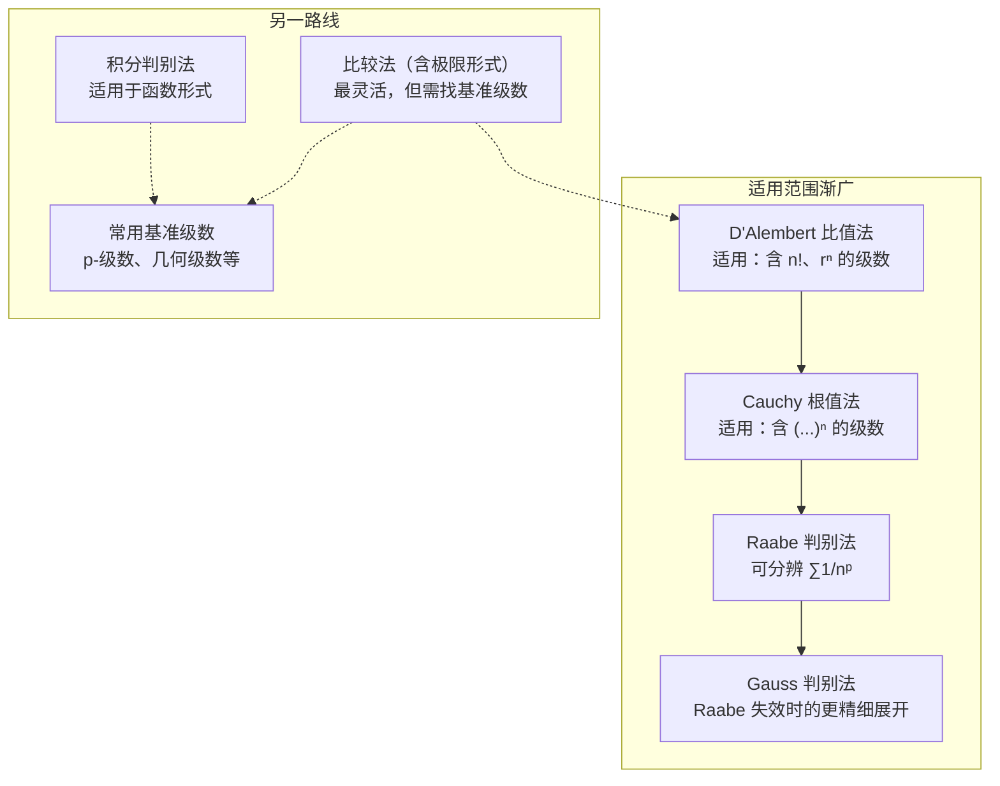

各判别法的强弱关系如下——顺着箭头方向，判别范围更广（可处理更"边界"的情形），但计算也更复杂。

> [!info] **使用建议**
> 遇到一个正项级数时，推荐的试探顺序：
> 1. **通项是否趋于 0？** —— 通项不趋于 0 则发散
> 2. **是否含 $n!$ 或 $r^n$？** —— 先试 D'Alembert 比值法
> 3. **是否含 $( \cdots )^n$？** —— 先试 Cauchy 根值法
> 4. **比值法 / 根值法结果为 1？** —— 试 Raabe 判别法
> 5. **通项是否为单调递减的函数形式？** —— 试积分判别法
> 6. **以上都不好使？** —— 回退到比较法，找合适的基准级数
